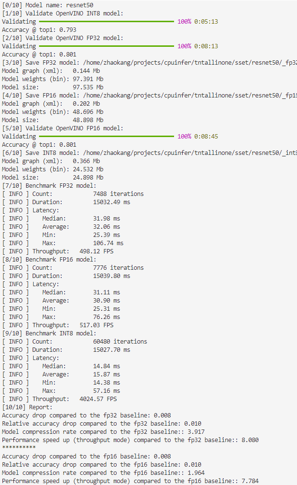

# QAccelX

## Introduction

QAccelX is a one-stop solution designed to streamline the acceleration of diverse deep learning models on x86 CPU platforms. Built upon the robust OpenVINO™ toolkit, QAccelX leverages quantization techniques to significantly enhance inference speeds while maintaining stringent control over model accuracy. With a single, user-friendly script, users can effortlessly apply quantization to their models, benchmark the performance improvements, and rigorously assess the impact on accuracy metrics. 

## Major Environment
(Not limited to)

python 3.12.9

pytorch 2.8

timm 1.0.15

openvino 2025.1.0


## Commands
```bash
python cpu_model_acceleration.py --model_name xxx --accuracy_control True_or_False --transformer_model True_or_False --weight_only True_or_False --dataset_path xxx --batch_size xxx --baseline_precision fp32_fp16 --debug True_or_False
```
Augements descriptions:
| Parameter | Type | Default | Choices | Description |
|-----------|------|---------|---------|-------------|
| `--model_name` | `str` | `tnt_s_patch16_224` | `tnt_s_patch16_224`, `deit_base_patch16_224`, `swin_tiny_patch4_window7_224`, `resnet50`, `mobilenetv2_100` | Specifies the model to be quantized. Choose from predefined architectures. |
| `--accuracy_control` | `bool` | `False` | True, False | Enables or disables accuracy control during quantization. **Set to `True` to enforce strict accuracy constraints.** |
| `--transformer_model` | `bool` | `False` | True, False | Specifies whether the model is a Transformer-based architecture. **Set to `True` for Transformer models, where SmoothQuant is applied during quantization.** |
| `--weight_only` | `bool` | `False` | True, False | Enables weight-only compression. When `True`, only model weights are quantized (activations remain unchanged). |
| `--dataset_path` | `str` | `/data/imagenet` | True, False | Path to the dataset directory. Default is `/data/imagenet`. |
| `--batch_size` | `int` | `128` | True, False | Batch size for inference/data loading. Default is `128`. |
| `--baseline_precision` | `str` | `fp32` | `fp32`, `fp16` | Baseline precision for model inference. Options: `fp32` (default) or `fp16`. **Note both FP32 and FP16 results are displayed when `fp32` is used.** |
| `--debug` | `bool` | `False` | True, False | Enables debug mode for verbose logging and additional checks. Set to `True` for detailed debugging. |

## Results
Tested on INTEL(R) XEON(R) GOLD 6530 CPU:
Multiple models can achieve significant acceleration with negligible or minimal impact on accuracy. The results below use the ImageNet-1K validation set to compute Top-1 accuracy and leverage the official OpenVINO codebase for benchmarking model performance.
| Model          | ResNet50 | Swin-tiny | MobileNetv2 | TNT   | DeiT-base |
|----------------|----------|-----------|-------------|-------|-----------|
| Original Accuracy (%) | 80.3     | 80.9      | 72.9        | 77    | 81.7      |
| Optimized Accuracy (%) | 79.3     | 79.8      | 72.5        | 76.7  | 80.7      |
| Original Time (ms)    | 31.34    | 41.56     | 3.43        | 190.41 | 608.9    |
| Optimized Time (ms)   | 16.78    | 12.65     | 3.01        | 64.47  | 121.55   |
| Inference Speedup    | 86.77%   | 228.54%   | 13.95%      | 195.35% | 400.95%  |
| Accuracy Loss        | 1%       | 1%        | 1%          | 0%     | 1%        |

## Some observations & tips
- For Swin Transformer and TNT models, relying solely on SmoothQuant is insufficient for accuracy recovery after quantization. The --accuracy_control flag must also be enabled as well. For instance, the ablation study of TNT is like:

| Scheme                          | Latency (ms) | Accuracy (%) |
|---------------------------------|--------------|--------------|
| Full Precision                  | 193          | 76.9         |
| Int8 Asymmetric (groupsize=128) | 210          | -            |
| Int8 Symmetric (groupsize=128)  | 243          | -            |
| Int8 Asymmetric (per channel)   | 209          | -            |
| Int8 Symmetric (per channel)    | 207          | -            |
| Int4 Asymmetric (per channel)   | 211          | -            |
| Int4 Symmetric (per channel)    | 206          | -            |
| W8A8 Symmetric + SmoothQuant    | 63           | 74.9         |
| W8A8 Symmetric + SmoothQuant + Mixed Precision Quantization | 62.47 | 76.7 |

From the table above, it is also observed that weight-only quantization can not speedup up TNT inference. Instead, the role of weight only quantization mainly lies in compressing the memory footprint of some models.

- Note the inference time of **FP16**, rather than FP32 model is baseline for compare speedups!

- The throughput of INT8 computation appears to be roughly 8 times that of FP16 or FP32 counterparts.
## Demo
Given:
```bash
python cpu_model_acceleration.py --model_name resnet50
```
The standard output of the command is like this:



Still updating from time to time!
